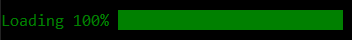

<h1 align="center">
    
    <br>
    <br>
    Progress Bar
  <br>
</h1>

<h3 align="center">A program made with C</a></h3>
<p align="center">
  • <a href="#what-is-it">What it is</a>
  • <a href="#how-to-run">How to run</a>
  • <a href="#preview">Preview</a>
</p>
<br>

## What it is

This is a small progress bar library to use in c or c++ console application.

Using this library you could create a progress bar animation inside the console.

## How to Run

To use this library import in your project or solution the library.h and library.c files. Then you must use the next line in the file where you want to use the function inside the library:

```
#include "loading.h"
```

Once done you can use the loadingBar function with the percentage that you want to show in the console

<br>

## Preview
<br>

